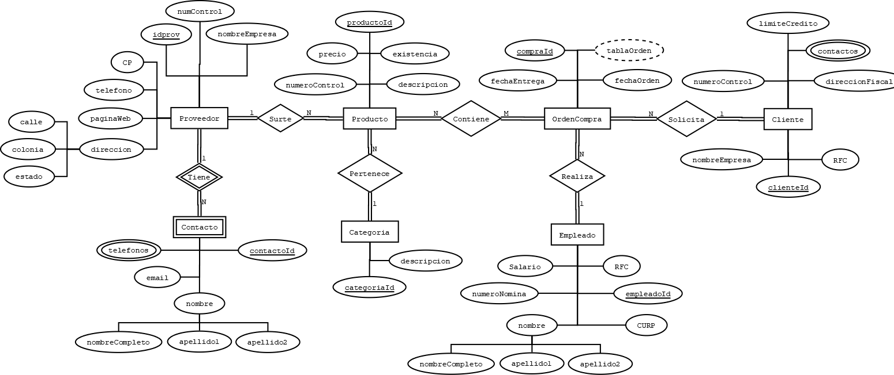

# Requerimientos
Una empresa encargada de las ventas de diferentes productos desea crear una base de datos que controle los proveedores clientes, empleados, categorías de producto y ordenes de compra, para los proveedores se necesita almacenar un número de control, nombre de la empresa, dirección que consta de número, calle, colonia y estado, código postal, teléfono, página web, teléfono de contacto o de contactos del proveedor, nombre del contacto, email del contacto. Para los empleados se desea almacenar un numero de nómina, nombre completo del empleado, RFC, CURP y salario (el salario no puede ser negativo y el máximo es de $65,000). Para las ordenes de compra se necesita crear la fecha de creación e la orden, el empleado que la realizó al cliente que se le vende, la fecha de entrega y los diferentes productos que contiene. El producto debe almacenar un número de control, una descripción única, la existencia y un precio. La categoría debe tener un identificador y nombre único de categoría. La compra siempre debe tener un precio de venta que se obtiene del precio unitario del producto y una cantidad vendida. 

# Modelo conceptual E-R

 

# Modelo Lógico Relacional 

# Diagrama Fisico con SQL-LDD

# Llenado de BD con SQL-LMD

# Consultas Simples
