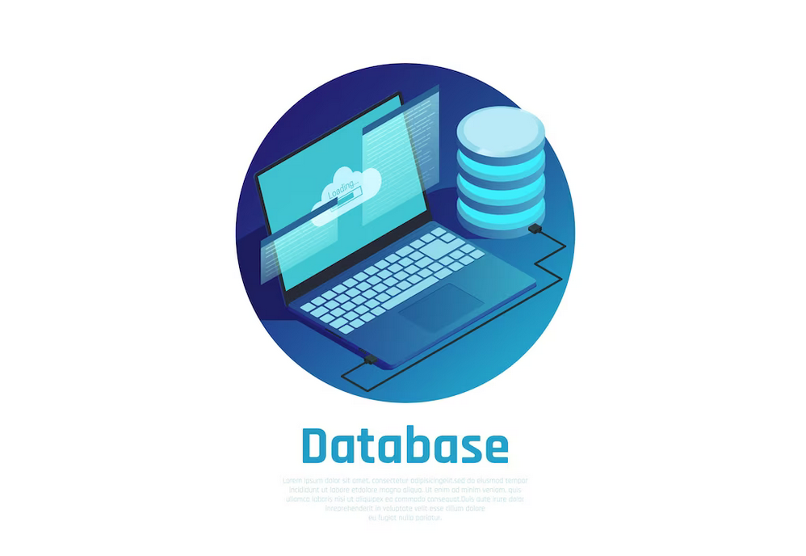

# Base de Datos para Aplicaciones

---

Este repositorio contiene información de base de datos referente a los siguientes temas:

1. Consultas con JOIN (inner join, left join, right join, full join)
2. Vistas/Views
3. Store Procedures
4. Triggers

# Aplicaiones-Para-Base-De-datos-
Este es mi repositorio de base de datos.
